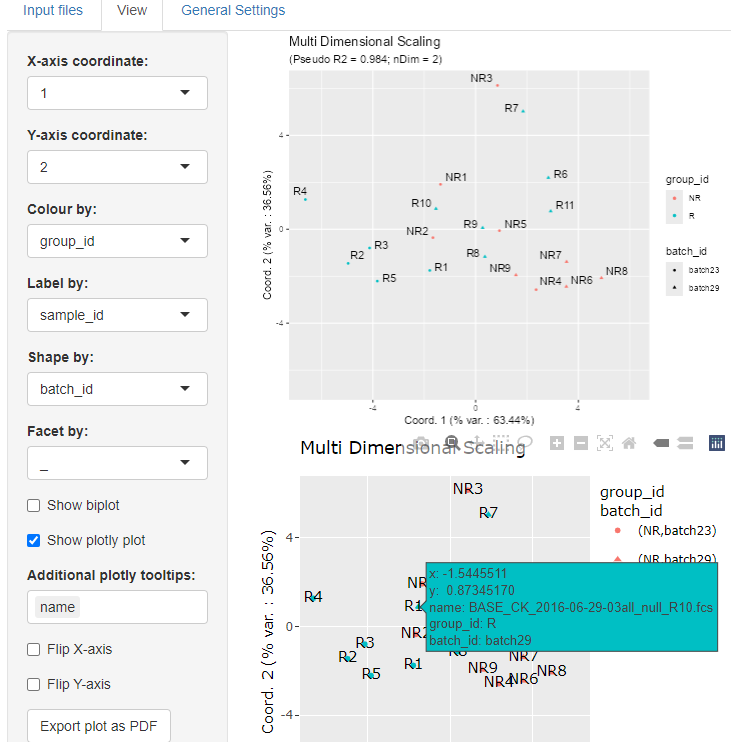

# MDSvis

The `MDSvis` package implements visualisation of Multi Dimensional Scaling (MDS)
objects representing a low dimensional projection of cytometry samples.
Such objects can be obtained using the functionalities implemented in the
`CytoMDS` package. The visualisation is realised via a Shiny app that allows 
the user to interactively customise the plots depending on a series of input
parameters.

Below a screenshot of the app 'View' tab. The controls on the side allow to
choose the projection axes, colour, label, facet or shape the points 
according to phenodata variables, add biplot, 
show a `plotly` plot for interactive plot exploration 
or flip axes.



### Installation

To install the package run the following lines:

```r
if (!require("devtools", quietly = TRUE))
    install.packages("devtools")

devtools::install_github(repo = 'https://github.com/UCLouvain-CBIO/MDSvis')
```

Note that `CytoMDS` version 1.3.5 or above needs to be installed before.

### License

The `MDSvis` code is provided under [GPL license version 3.0 or 
higher](https://opensource.org/licenses/GPL-3.0). The documentation, 
including the manual pages and the vignettes, are distributed under a [CC BY-SA 
4.0 license](https://creativecommons.org/licenses/by-sa/4.0/).

### Citation

If you use `MDSvis` in your research, please use the following citation:

>Hauchamps, Philippe, Simon Delandre, Stéphane T. Temmerman, 
> Dan Lin, and Laurent Gatto. 2025. 
> “Visual Quality Control with CytoMDS, a Bioconductor Package 
> for Low Dimensional Representation of Cytometry Sample Distances.” 
> Cytometry. Part A: 
> The Journal of the International Society for Analytical Cytology 107 (3): 177–86.

