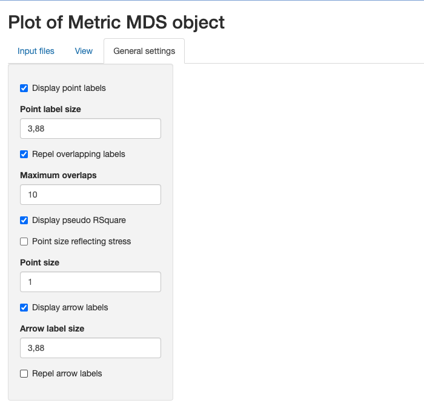

# Visualization of Multi Dimensional Scaling (MDS) objects

Abstract

This vignette is the main one describing the functionality implemented
in the `MDSvis` package. `MDSvis` conatins a shiny application enabling
interactive visualization of Multi Dimensional Scaling (MDS) objects.
This vignette is distributed under a CC BY-SA 4.0 license.

## Installation and loading dependencies

To install this package, start R and enter:

``` r

if (!require("BiocManager", quietly = TRUE))
    install.packages("BiocManager")

if (!require("MDSvis", quietly = TRUE))
    BiocManager::install("MDSvis")
```

We now load the packages needed in the current vignette:

``` r

library(HDCytoData)
library(CytoMDS)
library(MDSvis)
```

## Introduction

The `MDSvis` package implements visualization of Multi Dimensional
Scaling (MDS) objects representing a low dimensional projection of
sample distances. Such objects can be obtained using features
implemented in the `CytoMDS` package (Hauchamps et al. (2025)). For more
information see the [`CytoMDS`
vignette](https://www.bioconductor.org/packages/release/bioc/vignettes/CytoMDS/inst/doc/CytoMDS.html).

The visualization is done via a Shiny app that allows the user to
interactively customise the plots depending on a series of input
parameters (see the
[`CytoMDS::ggplotSampleMDS()`](https://uclouvain-cbio.github.io/CytoMDS/reference/ggplotSampleMDS.html)
function for more details on the parameters).

**IMPORTANT**: the example provided in the current vignette uses
cytometry data. As a result, the distance matrix, which contains the
pairwise sample distances, and serves as input to the MDS projection, is
here calculated from cytometry data samples using the `CytoMDS` package.
However, the input MDS object can also be calculated from any distance
matrix, where the units of interest are not necessarily cytometry
samples. This is demonstrated in this additional
[vignette](https://uclouvain-cbio.github.io/MDSvis/articles/MDSvis_Input_From_Distance.md).

## Illustrative dataset

We load an illustrative mass cytometry (*CyTOF*) dataset from (Krieg et
al. 2018), accessible from the Bioconductor *HDCytoData* data package
(Weber and Soneson (2019)).

*Krieg_Anti_PD_1* was used to characterize immune cell subsets in
peripheral blood from melanoma skin cancer patients treated with
anti-PD-1 immunotherapy.

This study found that the frequency of CD14+CD16-HLA-DRhi monocytes in
baseline samples (taken from patients prior to treatment) was a strong
predictor of survival in response to immunotherapy treatment.

Notably, this dataset contains a strong batch effect, due to sample
acquisition on two different days (Krieg et al. (2018)).

## Generation of input files

In the current section, we show how to build the input objects needed by
the shiny app, step by step. However, if you are only interested in the
description of the app functionalities, you might decide to launch the
application demo mode - which automatically pre-loads the
*Krieg_Anti_PD_1* dataset - and jump to [the next
section](#visualization-of-the-mds-projection).

First we load the *Krieg_Anti_PD_1* dataset, from the *HDCytoData*
package.

``` r

Krieg_fs <- Krieg_Anti_PD_1_flowSet()
```

    ## see ?HDCytoData and browseVignettes('HDCytoData') for documentation

    ## loading from cache

    ## Warning in updateObjectFromSlots(object, ..., verbose = verbose): dropping
    ## slot(s) 'colnames' from object = 'flowSet'

``` r

Krieg_fs
```

    ## A flowSet with 20 experiments.
    ## 
    ## column names(49): Pd104Di Pd105Di ... batch_id sample_id

Next we build a *phenodata* dataframe with experimental design
information, which are here found in the cytometry data structures.

``` r

# update phenoData structure

chLabels <- 
    keyword(Krieg_fs[[1]], "MARKER_INFO")$MARKER_INFO$channel_name
chMarkers <- 
    keyword(Krieg_fs[[1]], "MARKER_INFO")$MARKER_INFO$marker_name
marker_class <- 
    keyword(Krieg_fs[[1]], "MARKER_INFO")$MARKER_INFO$marker_class

chLabels <- chLabels[marker_class != "none"]
chMarkers <- chMarkers[marker_class != "none"]
# marker_class all equal to "type", 24 markers are left

phenoData <- flowCore::pData(Krieg_fs)
additionalPhenoData <- 
    keyword(Krieg_fs[[1]], "EXPERIMENT_INFO")$EXPERIMENT_INFO
phenoData <- cbind(phenoData, additionalPhenoData)
    
flowCore::pData(Krieg_fs) <- phenoData
```

Next, we scale-transform the mass cytometry data and calculate the
pairwise distance matrix.

``` r

# transform flow set (arcsinh(cofactor = 5))
trans <- arcsinhTransform(
    transformationId="ArcsinhTransform", 
    a = 0, 
    b = 1/5, 
    c = 0)

# Applying arcsinh() transformation
Krieg_fs_trans <- transform(
    Krieg_fs,
    transformList(chLabels, trans))

# Calculating Sample distances
pwDist <- pairwiseEMDDist(
    Krieg_fs_trans,
    channels = chMarkers,
    verbose = FALSE
)
```

From the distance matrix, we can now calculate the MDS projection. This
is also done using the `CytoMDS` package.

``` r

mdsObj <- computeMetricMDS(
    pwDist,
    seed = 0)

show(mdsObj)
```

    ## MDS object containing MDS projection (using Smacof algorithm)  data:
    ## Nb of dimensions:  2 
    ## Nb of points:  20 
    ## Stress:  0.052363 
    ## Pseudo RSquare:  0.984008 
    ## Goodness of fit:  0.997258

Optionally, for the use of biplots as an interpretation tool, sample
specific statistics can be provided by the user. Here we calculate
standard univariate statistics from each variable of the
multidimensional distribution (again using the `CytoMDS` package).

``` r

# Computing sample statistics

statFUNs <- c(
    "median" = stats::median, 
    "std-dev" = stats::sd,
    "mean" = base::mean,
    "Q25" = function(x, na.rm) 
        stats::quantile(x, probs = 0.25, na.rm = na.rm),
    "Q75" = function(x, na.rm) 
        stats::quantile(x, probs = 0.75, na.rm = na.rm))

chStats <- CytoMDS::channelSummaryStats(
    Krieg_fs_trans,
    channels = chMarkers,
    statFUNs = statFUNs)
```

The newly created objects can be saved as .rds files.  
These files can in turn be selected within the shiny app for
visualization.

``` r

saveRDS(mdsObj, file = "Krieg_mdsObj.rds")
saveRDS(phenoData, file = "Krieg_phenoData.rds")
saveRDS(chStats, file = "Krieg_chStats.rds")
```

## Visualization of the MDS projection

The `MDSvis` function `run_app` launches the interactive Shiny app and
the three tabs window in the figure below gets opened.

``` r

MDSvis::mdsvis_app()

# alternatively launch the application in demo mode, with the Krieg_Anti_PD_1
# dataset already loaded.
#MDSvis::mdsvis_app(preLoadDemoDataset = TRUE)
```

In the ‘Input files’ tab the objects can be loaded for visualization.
The plots are then shown in the ‘View’ tab while the ‘General settings’
contains more technical plot settings controls. All the input files are
expected to have .rds extension and at least a file containing the MDS
object has to be loaded. Optionally a phenodata file containing a
phenodata dataframe and/or a file containing a list of statistics for
biplot visualization can be loaded.

Alternatively, a ‘demo mode’ (see in commented code chunck above) allows
the user to launch the app with the *Krieg_Anti_PD_1* dataset
pre-loaded, without importing input .rds files.

 We can select the previously created files
and proceed with the visualization. Note that when a phenodata file is
selected a new control appears allowing to select only a subset of
variables (by default all are selected). These phenodata selected
variables will be the only ones available in the drop-down list controls
in the ‘View’ tab.

 We can now open the ‘View’ tab to see the
plot of the projection results. The controls on the side allow to choose
the projection axes; colour, label, define facet or shape the points
according to phenodata variables; add biplot; show a `plotly` plot for
interactive plot exploration or flip axes.

 For example we can colour the points according to
group_id, label the points according to sample_id, and use shapes
according to batch_id, as shown in the figure below.

 We can also defne facets according to the two
batches, as in the figure below:


We can also add a biplot created based on sample statistics by clicking
on the biplot checkbox. The idea is to calculate the correlation of the
sample statistics w.r.t. the axes of projection, so that these
correlations can be represented on a correlation circle overlaid on the
projection plot.

The desired statistic can be selected from the drop down menu and it is
possible to show only the arrows that respect a selected length
threshold.  
In the example below, the chosen statistic is the median while the arrow
length threshold is 0.8.


When some data are too large to be displayed as labels, one possible
solution is to display an interactive `plotly` plot below the regular
one by selecting the corresponding checkbox.  
We can add new `plotly` tooltips and highlight the corresponding
information for each point by hovering over them.


Finally, the obtained plots can be exported as a pdf file. The user can
defined the corresponding plot title, pdf file name and plot size (with
and height) to be used.


## General settings

For completeness we show below the ‘General settings’ tab which contains
some general controls regarding e.g. points features, the corresponding
labels and biplot arrows. For more details see the
[`CytoMDS::ggplotSampleMDS()`](https://uclouvain-cbio.github.io/CytoMDS/reference/ggplotSampleMDS.html)
function parameters.



## Session information

    ## R Under development (unstable) (2025-12-07 r89119)
    ## Platform: x86_64-pc-linux-gnu
    ## Running under: Ubuntu 24.04.3 LTS
    ## 
    ## Matrix products: default
    ## BLAS:   /usr/lib/x86_64-linux-gnu/openblas-pthread/libblas.so.3 
    ## LAPACK: /usr/lib/x86_64-linux-gnu/openblas-pthread/libopenblasp-r0.3.26.so;  LAPACK version 3.12.0
    ## 
    ## locale:
    ##  [1] LC_CTYPE=en_US.UTF-8       LC_NUMERIC=C              
    ##  [3] LC_TIME=en_US.UTF-8        LC_COLLATE=en_US.UTF-8    
    ##  [5] LC_MONETARY=en_US.UTF-8    LC_MESSAGES=en_US.UTF-8   
    ##  [7] LC_PAPER=en_US.UTF-8       LC_NAME=C                 
    ##  [9] LC_ADDRESS=C               LC_TELEPHONE=C            
    ## [11] LC_MEASUREMENT=en_US.UTF-8 LC_IDENTIFICATION=C       
    ## 
    ## time zone: UTC
    ## tzcode source: system (glibc)
    ## 
    ## attached base packages:
    ## [1] stats4    stats     graphics  grDevices utils     datasets  methods  
    ## [8] base     
    ## 
    ## other attached packages:
    ##  [1] MDSvis_0.99.4               CytoMDS_1.7.1              
    ##  [3] HDCytoData_1.31.0           flowCore_2.23.0            
    ##  [5] SummarizedExperiment_1.41.0 Biobase_2.71.0             
    ##  [7] GenomicRanges_1.63.0        Seqinfo_1.1.0              
    ##  [9] IRanges_2.45.0              S4Vectors_0.49.0           
    ## [11] MatrixGenerics_1.23.0       matrixStats_1.5.0          
    ## [13] ExperimentHub_3.1.0         AnnotationHub_4.1.0        
    ## [15] BiocFileCache_3.1.0         dbplyr_2.5.1               
    ## [17] BiocGenerics_0.57.0         generics_0.1.4             
    ## [19] BiocStyle_2.39.0           
    ## 
    ## loaded via a namespace (and not attached):
    ##   [1] splines_4.6.0        later_1.4.4          filelock_1.0.3      
    ##   [4] tibble_3.3.0         graph_1.89.1         XML_3.99-0.20       
    ##   [7] rpart_4.1.24         lifecycle_1.0.4      httr2_1.2.2         
    ##  [10] Rdpack_2.6.4         doParallel_1.0.17    flowWorkspace_4.23.0
    ##  [13] lattice_0.22-7       MASS_7.3-65          backports_1.5.0     
    ##  [16] magrittr_2.0.4       Hmisc_5.2-4          plotly_4.11.0       
    ##  [19] sass_0.4.10          rmarkdown_2.30       plotrix_3.8-13      
    ##  [22] jquerylib_0.1.4      yaml_2.3.11          httpuv_1.6.16       
    ##  [25] otel_0.2.0           DBI_1.2.3            minqa_1.2.8         
    ##  [28] RColorBrewer_1.1-3   abind_1.4-8          ggcyto_1.39.0       
    ##  [31] purrr_1.2.0          nnet_7.3-20          pracma_2.4.6        
    ##  [34] rappdirs_0.3.3       transport_0.15-4     gdata_3.0.1         
    ##  [37] ellipse_0.5.0        pkgdown_2.2.0.9000   codetools_0.2-20    
    ##  [40] DelayedArray_0.37.0  tidyselect_1.2.1     shape_1.4.6.1       
    ##  [43] farver_2.1.2         lme4_1.1-38          base64enc_0.1-3     
    ##  [46] jsonlite_2.0.0       e1071_1.7-16         mitml_0.4-5         
    ##  [49] Formula_1.2-5        survival_3.8-3       iterators_1.0.14    
    ##  [52] systemfonts_1.3.1    foreach_1.5.2        tools_4.6.0         
    ##  [55] ragg_1.5.0           Rcpp_1.1.0.8.1       glue_1.8.0          
    ##  [58] gridExtra_2.3        pan_1.9              SparseArray_1.11.8  
    ##  [61] xfun_0.54            dplyr_1.1.4          withr_3.0.2         
    ##  [64] BiocManager_1.30.27  fastmap_1.2.0        boot_1.3-32         
    ##  [67] shinyjs_2.1.0        digest_0.6.39        R6_2.6.1            
    ##  [70] mime_0.13            mice_3.18.0          textshaping_1.0.4   
    ##  [73] colorspace_2.1-2     gtools_3.9.5         RSQLite_2.4.5       
    ##  [76] weights_1.1.2        tidyr_1.3.1          hexbin_1.28.5       
    ##  [79] data.table_1.17.8    class_7.3-23         httr_1.4.7          
    ##  [82] htmlwidgets_1.6.4    S4Arrays_1.11.1      pkgconfig_2.0.3     
    ##  [85] gtable_0.3.6         blob_1.2.4           RProtoBufLib_2.23.0 
    ##  [88] S7_0.2.1             XVector_0.51.0       htmltools_0.5.9     
    ##  [91] bookdown_0.46        scales_1.4.0         png_0.1-8           
    ##  [94] wordcloud_2.6        reformulas_0.4.2     knitr_1.50          
    ##  [97] rstudioapi_0.17.1    checkmate_2.3.3      nlme_3.1-168        
    ## [100] curl_7.0.0           nloptr_2.2.1         proxy_0.4-27        
    ## [103] cachem_1.1.0         stringr_1.6.0        BiocVersion_3.23.1  
    ## [106] parallel_4.6.0       foreign_0.8-90       AnnotationDbi_1.73.0
    ## [109] desc_1.4.3           pillar_1.11.1        grid_4.6.0          
    ## [112] vctrs_0.6.5          promises_1.5.0       cytolib_2.23.0      
    ## [115] jomo_2.7-6           xtable_1.8-4         cluster_2.1.8.1     
    ## [118] htmlTable_2.4.3      Rgraphviz_2.55.0     evaluate_1.0.5      
    ## [121] cli_3.6.5            compiler_4.6.0       rlang_1.1.6         
    ## [124] crayon_1.5.3         smacof_2.1-7         ncdfFlow_2.57.0     
    ## [127] plyr_1.8.9           fs_1.6.6             stringi_1.8.7       
    ## [130] viridisLite_0.4.2    BiocParallel_1.45.0  nnls_1.6            
    ## [133] Biostrings_2.79.2    lazyeval_0.2.2       glmnet_4.1-10       
    ## [136] Matrix_1.7-4         bit64_4.6.0-1        CytoPipeline_1.11.0 
    ## [139] ggplot2_4.0.1        KEGGREST_1.51.1      shiny_1.12.0        
    ## [142] rbibutils_2.4        broom_1.0.11         memoise_2.0.1       
    ## [145] bslib_0.9.0          bit_4.6.0            polynom_1.4-1

## References

Hauchamps, Philippe, Simon Delandre, Stéphane T. Temmerman, Dan Lin, and
Laurent Gatto. 2025. “Visual Quality Control with CytoMDS, a
Bioconductor Package for Low Dimensional Representation of Cytometry
Sample Distances.” *Cytometry Part A* 107 (3): 177–86.
https://doi.org/<https://doi.org/10.1002/cyto.a.24921>.

Krieg, Carsten, Malgorzata Nowicka, Silvia Guglietta, et al. 2018.
“High-Dimensional Single-Cell Analysis Predicts Response to anti-PD-1
Immunotherapy.” *Nat. Med.* 24 (2): 144–53.

Weber, Lukas M, and Charlotte Soneson. 2019. “HDCytoData: Collection of
High-Dimensional Cytometry Benchmark Datasets in Bioconductor Object
Formats.” *F1000Res.* 8 (August): 1459.
