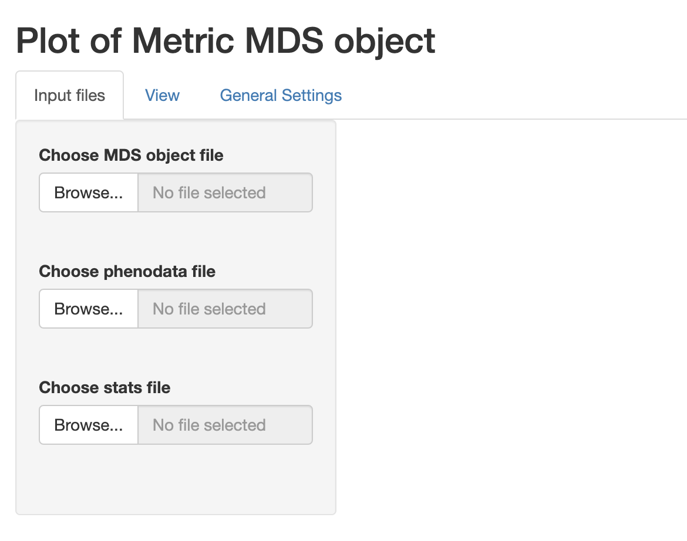

```{r style, echo = FALSE, results = 'hide'}
BiocStyle::markdown()
```

# Installation and loading dependencies

To install this package, start R and enter (un-commented):

```{r}
# if (!require("devtools", quietly = TRUE))
#     install.packages("devtools")
# 
# devtools::install_github(repo = 'https://github.com/UCLouvain-CBIO/MDSgui')
```

We now load the packages needed in the current vignette:

```{r rlibs, results=FALSE}
suppressPackageStartupMessages(library(HDCytoData))
library(CytoMDS)
library(MDSgui)
```

# Introduction

The `MDSgui` package implements visualization of Multi Dimensional Scaling (MDS)
objects representing a low dimensional projection of cytometry samples.
Such objects can be obtained using the functionalities implemented in the
`CytoMDS` package (@Hauchamps2024-nn). For more information see the [`CytoMDS` vignette](https://www.bioconductor.org/packages/release/bioc/vignettes/CytoMDS/inst/doc/CytoMDS.html). 
The visualization is realised via a Shiny app that allows 
the user to interactively customise the plots depending on a series of input
parameters (see the `CytoMDS::ggplotSampleMDS()` function for more details 
on the parameters).

# Illustrative data

We load an illustrative mass cytometry (*CyTOF*) dataset from
[@Bodenmiller2012-re], and provided in the Bioconductor *HDCytoData* data
package (@Weber2019-qp). For more information see [`CytoMDS` vignette](https://www.bioconductor.org/packages/release/bioc/vignettes/CytoMDS/inst/doc/CytoMDS.html).

```{r loadDataSet}
BCRXL_fs <- HDCytoData::Bodenmiller_BCR_XL_flowSet()
BCRXL_fs
```

# Computation of input files.

Next we compute the phenodata dataframe with experimental design information,
the MDS projection of the dataset as well as a list of sample statistics.
For a detailed description of each step see the [`CytoMDS` vignette](https://www.bioconductor.org/packages/release/bioc/vignettes/CytoMDS/inst/doc/CytoMDS.html).

```{r convertPhenoData}
phenoData <- flowCore::pData(BCRXL_fs)
additionalPhenoData <- 
    keyword(BCRXL_fs[[1]], "EXPERIMENT_INFO")$EXPERIMENT_INFO
phenoData <- cbind(phenoData, additionalPhenoData)

flowCore::pData(BCRXL_fs) <- phenoData
```

```{r MDSCalc}
# Select markers
markerInfo <- keyword(BCRXL_fs[[1]], "MARKER_INFO")$MARKER_INFO
chClass <- markerInfo$marker_class

chLabels <- markerInfo$channel_name[chClass != "none"]
(chMarkers <- markerInfo$marker_name[chClass != "none"])

# arcsinh() transformation
trans <- arcsinhTransform(
    transformationId="ArcsinhTransform", 
    a = 0, 
    b = 1/5, 
    c = 0)

# Scale transforming the raw data
BCRXL_fs_trans <- transform(
    BCRXL_fs,
    transformList(chLabels, trans))

# Calculating distances between samples
pwDist <- pairwiseEMDDist(
    BCRXL_fs_trans,
    channels = chMarkers,
    verbose = FALSE
)

# Computing the MDS projection
mdsObj <- computeMetricMDS(pwDist, seed = 0)
show(mdsObj)
```

```{r statsCalc}
# Computiong sample statistics
statFUNs = c("median" = stats::median,
             "Q25" = function(x, na.rm) {
                 stats::quantile(x, probs = 0.25)
             },
             "Q75" = function(x, na.rm) {
                 stats::quantile(x, probs = 0.75)
             },
             "standard deviation" = stats::sd)
chStats <- channelSummaryStats(BCRXL_fs_trans,
                               channels = chLabels, 
                               statFUNs = statFUNs)
```

We save the newly created objects as .rds files. These files can be selected
within the shiny app for visualization.

```{r}
saveRDS(mdsObj, file = "mdsObj.rds")
saveRDS(phenoData, file = "phenoData.rds")
saveRDS(chStats, file = "chStats.rds")
```

# Visualization of the MDS projection

The `MDSgui` function `run_app` launches the interactive Shiny app and the
three tabs window in the figure below gets opened. In the
'Input files' tab the objects can be loaded for visualization. The plots
are then shown in the 'View' tab while the 'General Settings' contains more
technical plot settings controls. All the input files are expected to
have .rds extension and at least a file containing MDS object has
to be loaded. Optionally a phenodata file containing a phenodata dataframe
and/or a file containing a list of statistics for biplot visualization
can be loaded.


We can select the previously created files and proceed with the visualization.
Note that when a phenodata file is selected a new control appears allowing
to select only a subset of variables (by default all are selected). These 
phenodata selected variables will be the only ones available in the drop-down 
list controls in the 'View' tab.


We can now open the 'View' tab to see the plot of the projection results.
The controls on the side allow to choose the projection axes, colour, label,
or shape the points according to phenodata variables, add biplot,
show a `plotly` plot for interactive plot exploration or flip axes. 


For example we can colour the points according to group_id and label the points
according to patient_id as shown in the figure below.


We can also add a biplot created based on sample statistics by clicking on the
biplot checkbox. The idea is to calculate the correlation of the sample
statistics w.r.t. the axes of projection, so that these correlations can be
represented on a correlation circle overlaid on the projection plot.
The desired statistic can be selected from the drop down menu and
it is possible to show only the arrows that respect a selected length threshold.  
In the example below, the chosen statistic is the median while the arrow length
threshold is 0.8.


Finally it is possible to display an interactive `plotly` plot below the regular
one by selecting the corresponding checkbox. We can also add new `plotly` 
tooltips and highlight the corresponding information for each point 
by hovering over them.


# General Settings

(TO DO)  

# Session information {-}

```{r sessioninfo, echo=FALSE}
sessionInfo()
```

# References {-}

