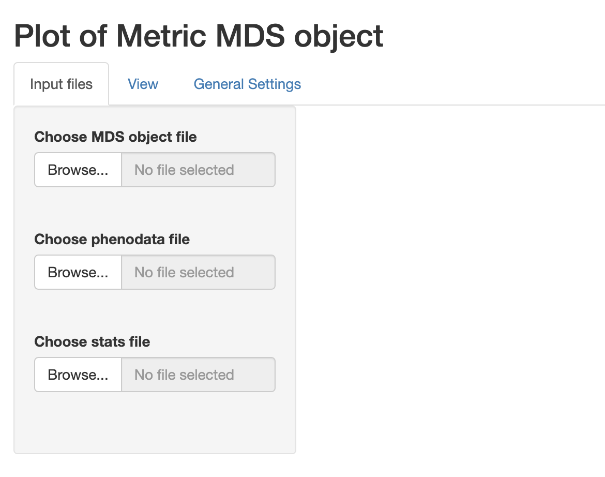
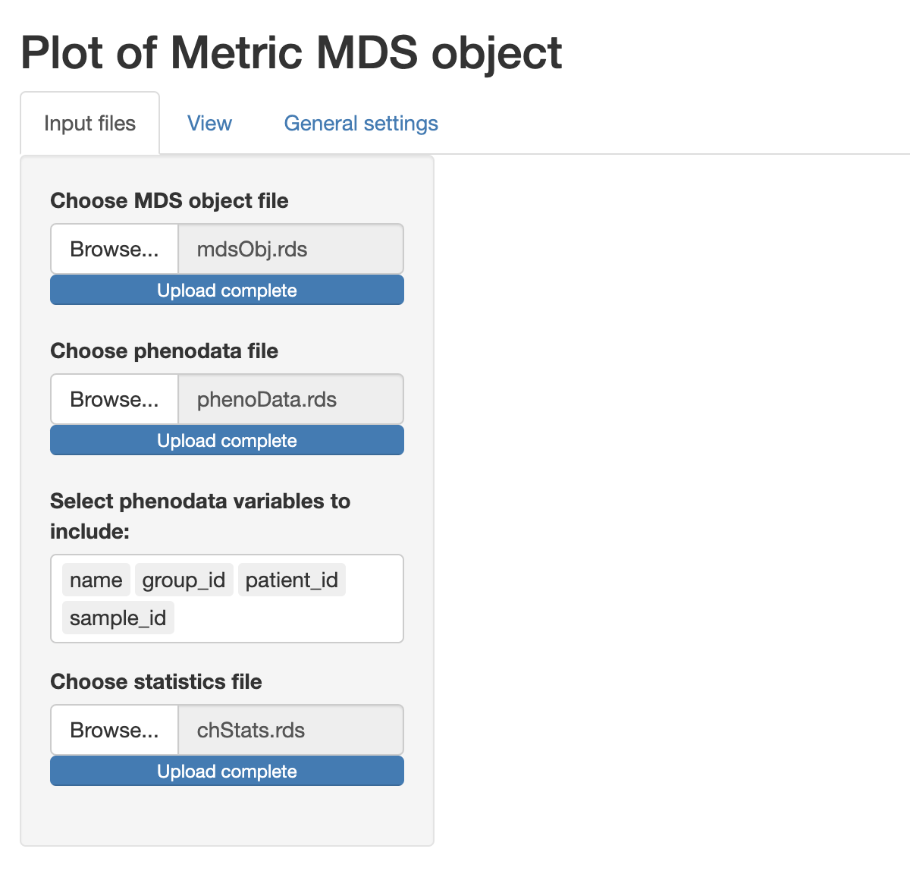
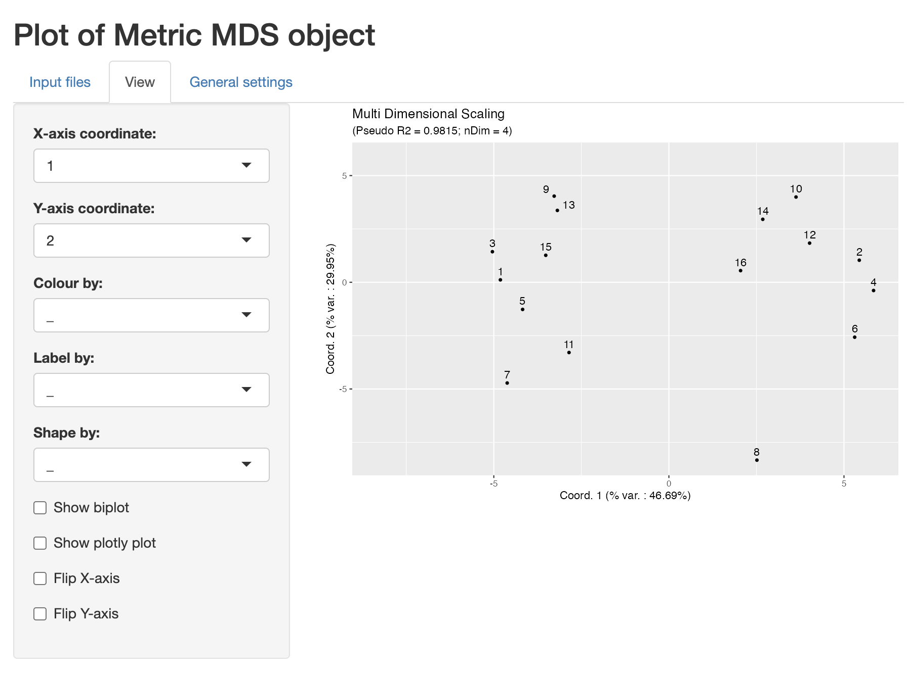
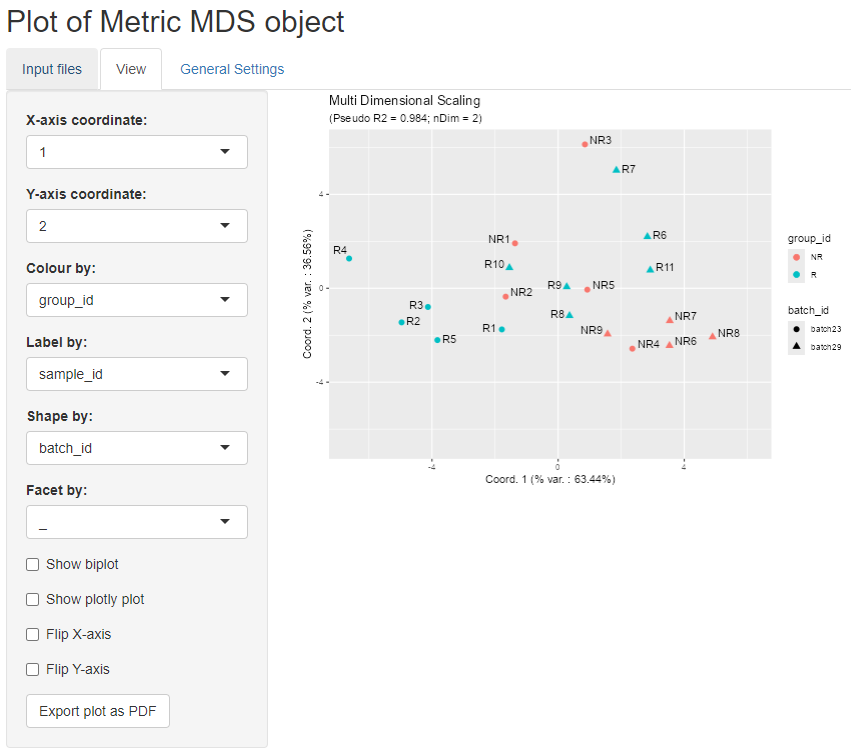
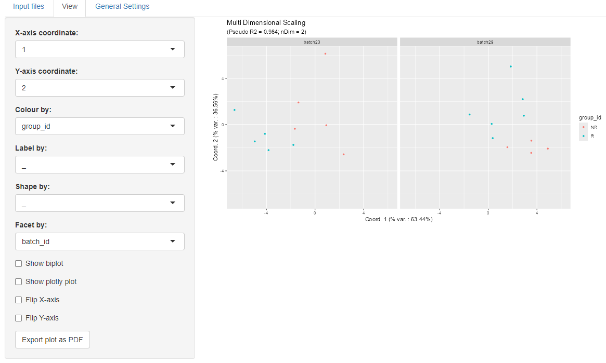
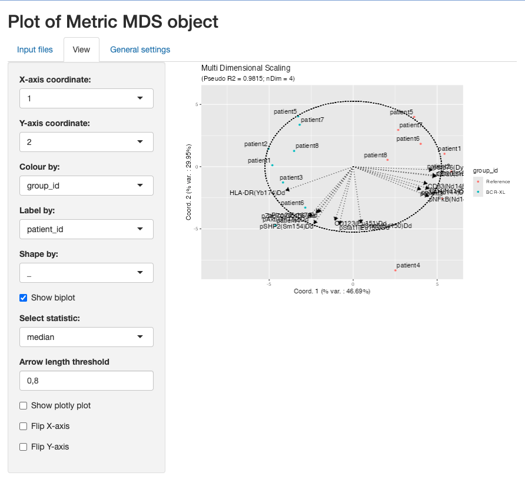
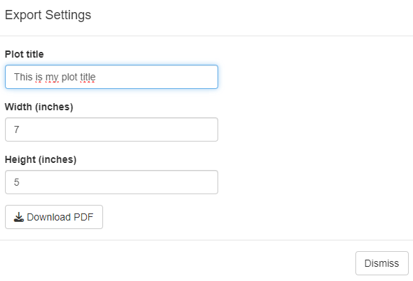
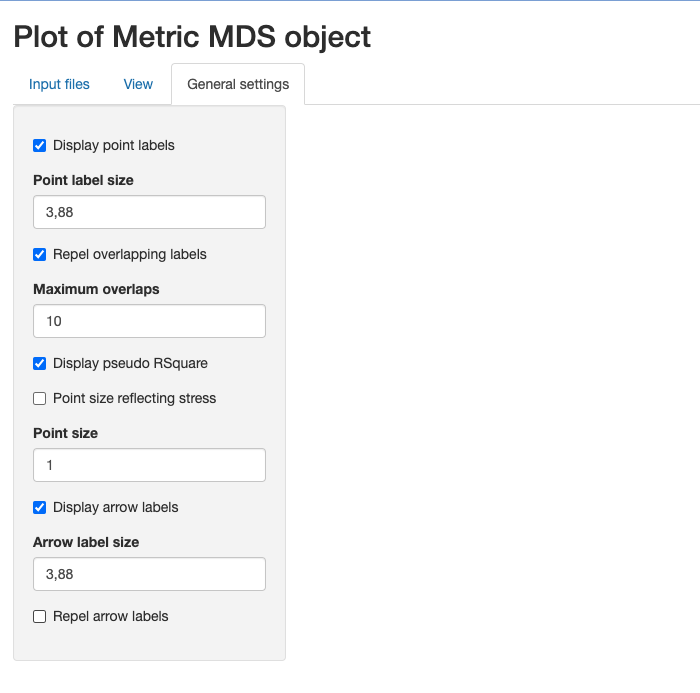

```{r style, echo = FALSE, results = 'hide'}
BiocStyle::markdown()
```

# Installation and loading dependencies

To install this package, start R and enter (un-commented):

```{r}
# if (!require("devtools", quietly = TRUE))
#     install.packages("devtools")
# 
# devtools::install_github(repo = 'https://github.com/UCLouvain-CBIO/MDSvis')
```

We now load the packages needed in the current vignette:

```{r rlibs, results=FALSE}
suppressPackageStartupMessages(library(HDCytoData))
suppressPackageStartupMessages(library(CytoMDS))
library(MDSvis)
```

# Introduction

The `MDSvis` package implements visualization of Multi Dimensional Scaling (MDS)
objects representing a low dimensional projection of sample distances.
Such objects can be obtained using features implemented in the `CytoMDS` 
package (@Hauchamps2025-zm). For more information see the [`CytoMDS` vignette](https://www.bioconductor.org/packages/release/bioc/vignettes/CytoMDS/inst/doc/CytoMDS.html).  

The visualization is done via a Shiny app that allows 
the user to interactively customise the plots depending on a series of input
parameters (see the `CytoMDS::ggplotSampleMDS()` function for more details 
on the parameters).  

**IMPORTANT**: the example provided in the current vignette uses cytometry data. 
As a result, the distance matrix, which contains the pairwise sample distances, 
and serves as input to the MDS projection, is here 
calculated from cytometry data samples using the `CytoMDS` package. 
However, the input  MDS object can also be calculated from any distance matrix, 
where the units of interest are not necessarily cytometry samples. This is 
demonstrated in this additional [vignette](MDSvis_Input_From_Distance.html).

# Illustrative dataset

We load an illustrative mass cytometry (*CyTOF*) dataset from
[@Krieg2018-zs], accessible from the Bioconductor *HDCytoData* data
package (@Weber2019-qp).   

*Krieg_Anti_PD_1* was used to characterize immune cell subsets in 
peripheral blood from melanoma skin cancer patients treated 
with anti-PD-1 immunotherapy.   

This study found that the frequency of CD14+CD16-HLA-DRhi monocytes 
in baseline samples (taken from patients prior to treatment) was a strong 
predictor of survival in response to immunotherapy treatment.  

Notably, this dataset contains a strong batch effect, 
due to sample acquisition on two different days (@Krieg2018-zs).

```{r loadDataSet}
Krieg_fs <- Krieg_Anti_PD_1_flowSet()
Krieg_fs
```

# Computation of input files

Next we build a *phenodata* dataframe with experimental design information, 
which are here found in the cytometry data structures.

```{r convertPhenoData}
# update phenoData structure

chLabels <- 
    keyword(Krieg_fs[[1]], "MARKER_INFO")$MARKER_INFO$channel_name
chMarkers <- 
    keyword(Krieg_fs[[1]], "MARKER_INFO")$MARKER_INFO$marker_name
marker_class <- 
    keyword(Krieg_fs[[1]], "MARKER_INFO")$MARKER_INFO$marker_class

chLabels <- chLabels[marker_class != "none"]
chMarkers <- chMarkers[marker_class != "none"]
# marker_class all equal to "type", 24 markers are left

phenoData <- flowCore::pData(Krieg_fs)
additionalPhenoData <- 
    keyword(Krieg_fs[[1]], "EXPERIMENT_INFO")$EXPERIMENT_INFO
phenoData <- cbind(phenoData, additionalPhenoData)
    
flowCore::pData(Krieg_fs) <- phenoData
```

Next, we scale-transform the mass cytometry data and calculate the pairwise 
distance matrix.

```{r distCalc}
# transform flow set (arcsinh(cofactor = 5))
trans <- arcsinhTransform(
    transformationId="ArcsinhTransform", 
    a = 0, 
    b = 1/5, 
    c = 0)

# Applying arcsinh() transformation
Krieg_fs_trans <- transform(
    Krieg_fs,
    transformList(chLabels, trans))

# Calculating Sample distances
pwDist <- pairwiseEMDDist(
    Krieg_fs_trans,
    channels = chMarkers,
    verbose = FALSE
)
```

From the distance matrix, we can now calculate the MDS projection. This is also 
done using the `CytoMDS` package.

```{r MDSCalc}
mdsObj <- computeMetricMDS(
    pwDist,
    seed = 0)

show(mdsObj)
```

Optionally, for the use of biplots as an interpretation tool, sample specific 
statistics can be provided by the user. Here we calculate standard univariate 
statistics from each variable of the multidimensional distribution (again using 
the `CytoMDS` package). 

```{r statsCalc}
# Computing sample statistics

# statFUNs = c("median" = stats::median,
#              "Q25" = function(x, na.rm) {
#                  stats::quantile(x, probs = 0.25)
#              },
#              "Q75" = function(x, na.rm) {
#                  stats::quantile(x, probs = 0.75)
#              },
#              "standard deviation" = stats::sd)
# chStats <- channelSummaryStats(BCRXL_fs_trans,
#                                channels = chLabels, 
#                                statFUNs = statFUNs)

statFUNs <- c("median" = stats::median,
              "std-dev" = stats::sd,
              "mean" = base::mean,
              "Q25" = function(x, na.rm) 
                  stats::quantile(x, probs = 0.25, na.rm = na.rm),
              "Q75" = function(x, na.rm) 
                  stats::quantile(x, probs = 0.75, na.rm = na.rm))

chStats <- CytoMDS::channelSummaryStats(
    Krieg_fs_trans,
    channels = chMarkers,
    statFUNs = statFUNs)

```

We save the newly created objects as .rds files.  
(Uncomment the corresponding code to do it).  
These files can now be selected within the shiny app for visualization.  

```{r}
#saveRDS(mdsObj, file = "Krieg_mdsObj.rds")
#saveRDS(phenoData, file = "Krieg_phenoData.rds")
#saveRDS(chStats, file = "Krieg_chStats.rds")
```

# Visualization of the MDS projection
```{r}
# MDSvis::run_app()
```


The `MDSvis` function `run_app` launches the interactive Shiny app and the
three tabs window in the figure below gets opened. In the
'Input files' tab the objects can be loaded for visualization. The plots
are then shown in the 'View' tab while the 'General settings' contains more
technical plot settings controls. All the input files are expected to
have .rds extension and at least a file containing the MDS object has
to be loaded. Optionally a phenodata file containing a phenodata dataframe
and/or a file containing a list of statistics for biplot visualization
can be loaded.


We can select the previously created files and proceed with the visualization.
Note that when a phenodata file is selected a new control appears allowing
to select only a subset of variables (by default all are selected). These 
phenodata selected variables will be the only ones available in the drop-down 
list controls in the 'View' tab.


We can now open the 'View' tab to see the plot of the projection results.
The controls on the side allow to choose the projection axes; colour, label, 
define facet or shape the points according to phenodata variables; add biplot;
show a `plotly` plot for interactive plot exploration or flip axes. 


For example we can colour the points according to group_id, 
label the points according to sample_id, 
and use shapes according to batch_id, as shown in the figure below.


We can also defne facets according to the two batches, as in the figure below:  



We can also add a biplot created based on sample statistics by clicking on the
biplot checkbox. The idea is to calculate the correlation of the sample
statistics w.r.t. the axes of projection, so that these correlations can be
represented on a correlation circle overlaid on the projection plot.  

The desired statistic can be selected from the drop down menu and
it is possible to show only the arrows that respect a selected length threshold.  
In the example below, the chosen statistic is the median while the arrow length
threshold is 0.8.



When some data are too large to be displayed as labels, 
one possible solution is to display an interactive `plotly` plot 
below the regular one by selecting the corresponding checkbox.   
We can add new `plotly` tooltips and highlight the corresponding information 
for each point by hovering over them.


Finally, the obtained plots can be exported as a pdf file. 
The user can defined the corresponding plot title, pdf file name 
and plot size (with and height) to be used. 



# General settings

For completeness we show below the 'General settings' tab which
contains some general controls regarding e.g. points features, the
corresponding labels and biplot arrows. For more details see the
`CytoMDS::ggplotSampleMDS()` function parameters.



# Session information {-}

```{r sessioninfo, echo=FALSE}
sessionInfo()
```

# References {-}

