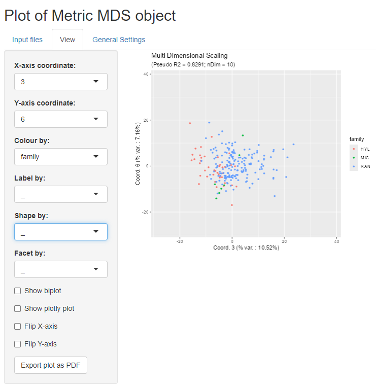

```{r style, echo = FALSE, results = 'hide'}
BiocStyle::markdown()
```

# Introduction

This short vignette is complementary to the [main](MDSvis.html) `MDSvis` package 
vignette, which provides an overview of `MDSvis` Shiny application (app) 
features.  

Here we focus on 'how to' create some input objects, which need to be provided 
to the Shiny app. In this vignette, we show that we can take advantage of the 
*Multi Dimensional Scaling (MDS)* interactive visualisations, 
starting from any distance matrix, and some sample specific properties.  

# Installation and loading dependencies

To install this package, start R and enter (un-commented):

```{r}
# if (!require("devtools", quietly = TRUE))
#     install.packages("devtools")
# 
# devtools::install_github(repo = 'https://github.com/UCLouvain-CBIO/MDSvis')
```

We now load the packages needed in the current vignette:

```{r rlibs, results=FALSE}
suppressPackageStartupMessages(library(CytoMDS))
library(MDSvis)
```


# Dataset

For this vignette, we use the *frog skin active peptide (fsap)* dataset. 
It consists of 226 samples, where each sample represents an amino acid sequence 
corresponding to a reported amphibian host defence peptide.

Distances between these peptides can be obtained using pairwise alignments and 
computing an appropriate dissimilarity metric between their amino acid 
sequences. For details, see the [fsap dataset methods section](#fsap_methods) 
below.   

On top of the peptide distances, peptide properties have also been collected:  
- Uniprot accession number  
- taxonomic family, genus, species  
- some physicochemical parameters  

In the following code, we import the two text files of the dataset:  
- the distance matrix file (imported as a R `matrix`)  
- the sample properties file (imported as a R `data.frame`)  

```{r loadDataSet}
# inputs
inputDir <- system.file("extdata", package = "MDSvis")
distPath <- file.path(inputDir, "fsap_mature_226_distances.txt")
propPath <- file.path(inputDir, "fsap_mature_226_properties.txt")

# reading distance matrix from disk
distData <- read.delim(distPath)
rownames(distData) <- distData$X
distData$X <- NULL
distMat <- as.matrix(distData)

# reading properties
propDF <- read.delim(propPath)
```

# Generation of input files for the Shiny application

We still need to pre-process the data properties and split them into two parts:
- the variables that will be used to annotate the plots, or associate colour,
shape, faceting etc. These variable are mostly factor variables. We extract 
them into the *phenoData* object - which needs to be a `data.frame`.
- the continuous variables that can be exploited as sample *statistics* in the 
bi-plots. These need to be included in a list of statistics object.

```{r convertPhenoData}
# split properties between factors and continuous variables (stats)

statMat <- as.matrix(propDF[, -1])
statList <- list(quant_properties = statMat)

propDF <- propDF[, 1, drop = FALSE]
propDF$family <- factor(substr(propDF$Sequence_Name, start = 1, stop = 3))
propDF$genus <- factor(substr(propDF$Sequence_Name, start = 1, stop = 6))
propDF$species <- factor(substr(propDF$Sequence_Name, start = 1, stop = 8))
```

Below are frequency tables for peptides belonging to the different families, genera and species.

```{r tables}
table(propDF$family)
table(propDF$genus)
table(propDF$species)
```

From the distance matrix, we now need to calculate the MDS projection object, 
which will be used as main input in the Shiny app.  
This is done using the `CytoMDS` package. Here we set the number of projection 
dimensions to 10. See the documentation of `CytoMDS::computeMetricMDS()` for 
details on other possible options.

```{r MDSCalc}
MDSObj <- CytoMDS::computeMetricMDS(pwDist = distMat, 
                                    nDim = 10)

show(MDSObj)
```

Finally, we can save the newly created objects as .rds files on disk.  
(Uncomment the corresponding code to do it).  
These files can now be selected within the shiny app for visualization.  

```{r}
# outputs (for shiny app)
MDSRDSPath <- "fsap_mature_MDS.rds"
statRDSPath <- "fsap_mature_stats.rds"
propRDSPath <- "fsap_mature_props.rds"

# saving objects 
#saveRDS(MDSObj, file = MDSRDSPath)
#saveRDS(statList, file = statRDSPath)
#saveRDS(propDF, file = propRDSPath)
```

# Visualization of the MDS projection

The `MDSvis` function `run_app` launches the interactive Shiny app. 
From here, you can take a look at the [main](MDSvis.html) `MDSvis` vignette 
for an overview of the Shiny app features.   

```{r}
#MDSvis::run_app()
```

  
Here below is a screen shot from the Shiny app, 
displaying a view of the MDS projection of the `fsap` dataset.




# fsap dataset methods
<a name="fsap_methods">
</a>


## Data mining and assembly of a reference dataset  

For the construction of an initial dataset of known amphibian host defence peptides, sequences belonging to the “frog skin active peptide” superfamily (FSAP; InterPro: IPR016322) were collected from the Uniprot database and relevant literature. FSAP from the higher-level taxonomic classifications of Ranidae, Microhylidae and Hyloidea are differentiated using the prefixes RAN_, MIC_ and HYL_, respectively. These designations are broadly referred to as "family" throughout this vignette. Each family prefix is followed by a letter code to identify the genus and species from which the FSAP was identified, followed by its unique Uniprot accession. Each FSAP precursor protein is composed of a tripartite structure in which the N-terminal signal peptide and spacer regions are enzymatically cleaved to release the bioactive, or "mature" peptide. A total of 226 mature FSAP were thus identified and used for subsequent analysis.

## Pairwise alignments using primary structure and hydrophobicity  

Pairwise alignments of mature FSAP sequences were generated with AlignMe 1.2 (Stamm et al., 2013) using a combined scale that incorporates the Hessa, White and von Heinje hydropathy scale (HWvH; weight: 2.6 [Hessa et al., 2007]) and the VTML substitution matrix (weight: 0.5), according to the developer’s recommendations. Gap penalties were similarly based on Stamm et al. (2014) and were set as follows: below threshold gap opening penalty: 18.0, below threshold gap extension penalty: 1.3, above threshold gap opening penalty: 11.0, above threshold gap extension penalty 4.4: thresholds for penalties: 0; termini gap opening penalty 13.1; termini gap extension penalty: 0.9 (Stamm et al. 2014). Given the short lengths of mature FSAP sequences, window size was set to 0 to prevent a smoothing effect. Absolute differences between the hydrophobicity measurements generated for each peptide pair were calculated and used to construct a distance, or dissimilarity matrix.

## Physicochemical parameters distinguishing FSAP  

The following parameters were calculated for each mature FSAP sequence:
1)	peptide length (number of amino acids)
2)	grand average of hydropathy, or GRAVY index (obtained by dividing the sum of hydropathy values of all amino acids by total sequence length), to determine the hydrophobicity/hydrophilicity of the protein; a positive index indicates a more hydrophobic character, whereas a negative index indicates a more hydrophilic character
3)	hydrophobic moment (measure of the amphipathicity of a structure, or asymmetry of hydrophobicity, by quantifying the distribution of hydrophobic and hydrophilic residues along its length; particularly relevant for α-helices)
4)	isoelectric point, or pI (pH at which the peptide carries a net electrical charge of zero)
5)	molar mass
6)	net charge at pH 7
7)	cysteine content (%)
8)	ratio of lysines to arginines (e.g., changes in this ratio in α-helical peptides can affect the hydrophobicity required for membrane perturbation)

# Acknowledgement
We would like to thank Shabnam Zaman and Kim Roelants from the Ecology, Evolution & Genetics (bDIV)
research group at the Vrije Universiteit Brussel (VUB) for providing us with the `fsap` dataset, as
well as the corresponding [fsap dataset methods section](#fsap_methods) 
in the current vignette. 

# Session information {-}

```{r sessioninfo, echo=FALSE}
sessionInfo()
```

